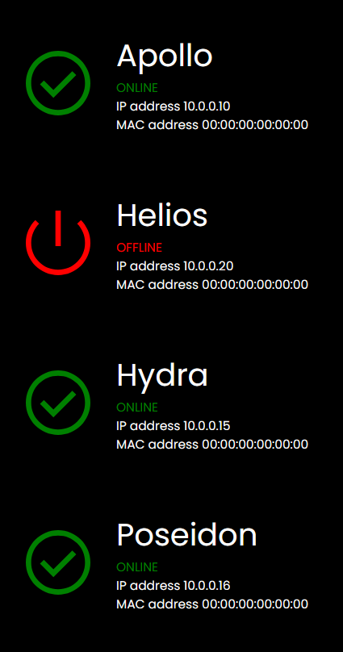
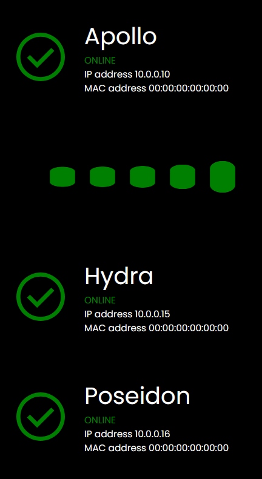
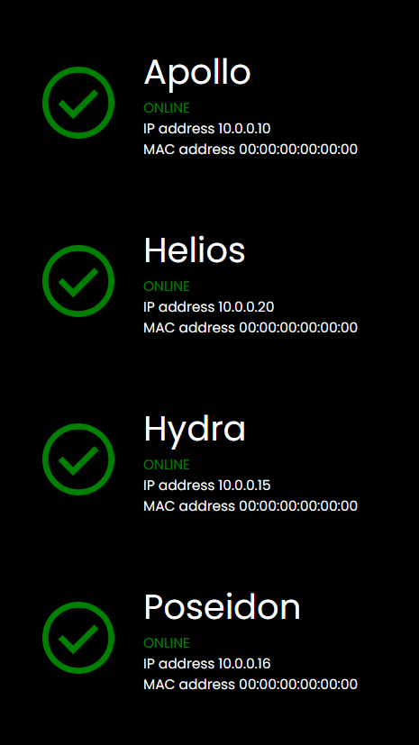

# Wake on Lan Controller w/ GUI

** This project is still in its early stages, it's not perfect, but it is a good proof of concept, and does accomplish the goal of remotely turning on a pc. I understand WOL has security issues, use this at your own risk and take procautions to limit exposure.**

## To run this project:

Edit the `servers.yml` file and includes one or more servers. 
### Example servers.yml file

```
servers:
  - name: helios
    ip: 10.0.0.2
    mac: 00:00:00:00:00:00
    broadcast: 10.0.0.255

  - name: hydra
    ip: 10.0.0.3
    mac: 00:00:00:00:00:00
    broadcast: 10.0.0.255
```
### Once your config is ready:
 - `npm install` 
 - `npm start`

If you change anything in the `client` folder, run `npm run build` to build the React frontend, and make those changes available to the server.

<hr/>

I made this project when I first learned about the possibilities of WOL (Wake on Lan).

I have a fairly unique homelab setup, involving multiple dedicated servers and general purpose workstations. Sometimes I may use my desktop pc for programming, and if it's off, I have to walk across the house to turn it on.

No thank you.

Since I have network interface cards in all of my machines, it makes it possible to turn on these machines with a 'magic packet' sent over my local network.

After some brief research about how this system works, I opened up VSCode and went to work.

Initially my intension was to make a basic Node.js server and an even simpler static HTML page to control a single server. I had a button with a click event, which would send an HTTP request to the server to signal the WOL packet to be broatcas on my subnetm targeting my primary server's MAC address. The server would then send an HTTP response with a redirect to a 'success' page (even if the WOL command failed). Not ideal.

After some planning, I decided to rework the whole project, and come at this from a different angle. React and websockets. Exactly what I needed.

I also added the ability to use a YML file to configure the server to manage multiple machines. 


### The React UI:

This is the dashboard. You can see it shows the status of all servers loaded from the `servers.yml` file. Currently 'Helios' is offline (off).

**MAC addresses have been removed for security reasons**



If you hover over the offline server, you will see the css hover effect:


Upon clicking the offline server, you will get a custom loading indicator, while it sends the magic WOL packets.

I have added functionality for the server to confirm if the WOL signal worked. The server will ping the target machine at an interval, and once the ping command gets a response, the React UI will change to show the server as 'online'. If the ping commands fail in a given period, the server will still show 'offline'.



As you can see below, the WOL command worked, and Helios is online.



Due to the use of websockets, this program runs much more effeciently, as it doesn't have to poll the server constantly for updates, updates are pushed from the server from an event.

In conclusion, this has been a fun project, and I learned a lot about networking, websockets and WOL in general. Maybe this isn't the most useful tool in the world, but it makes my life easier and has accomplished what I set out to do.